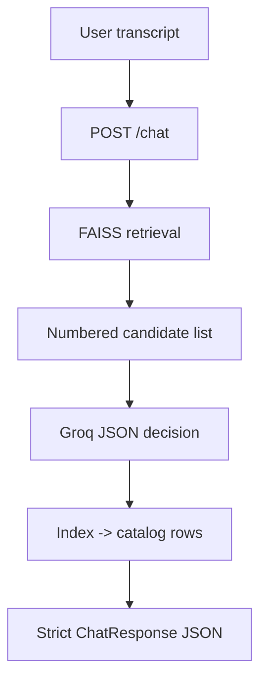

# TalentLens · Conversational SHL Assessment Recommender

Portfolio-grade implementation for the SHL Labs **AI Intern** take-home: a **stateless** FastAPI service that chats with recruiters, stays **grounded to the SHL Individual Test Solutions catalog**, and returns an **automated-evaluator-compatible** JSON contract every time.

> Security note: if any study materials accidentally contain a plaintext API credential, rotate that key immediately and never commit `.env`.

## Problem statement

Hiring scenarios are expressed in messy natural language (“mid-level Rust + networking…”); catalog search assumes you already speak SHL taxonomy. This system uses **conversation + retrieval** to move from fuzzy intent → **1–10 catalog URLs** (`name`, `url`, `test_type`) without inventing assessments.

## What you get

- **Backend**: `GET /`, `GET /health`, `POST /chat` (**stateless transcript** every call)
- **RAG retrieval**: embeddings + **FAISS** inner-product search across the cleaned catalog corpus
- **Reasoning**: **Groq** chat completion with **`response_format=json_object` when supported**
- **Hard grounding**: URLs/names ONLY come from the retrieved candidate subset for that turn, mapped deterministically via `selected_indices`
- **Frontend**: React + Vite + Tailwind + Framer Motion (“ChatGPT-ish” recruiter UI + trace-style metadata line)

## Architecture (high level)



## Folder structure

```
├── backend/
│   ├── app/
│   │   ├── config/
│   │   ├── models/
│   │   ├── rag/
│   │   ├── prompts/
│   │   ├── services/
│   │   ├── utils/
│   │   └── main.py
│   ├── data/                # downloaded at runtime (ignored by git)
│   ├── requirements.txt
│   ├── Dockerfile
│   ├── render.yaml
│   └── tests/
├── frontend/
├── docs/
├── conversation_traces/
└── docker-compose.yml
```

## Tech stack

- Backend: FastAPI, Pydantic v2, httpx (catalog download), `json-repair` (sanitize upstream JSON quirks), Sentence Transformers, FAISS, Groq
- Frontend: React 18, Vite, Tailwind, Framer Motion

## Prerequisites

- Python **3.12+** recommended (**use a venv**, not your global conda base environment)
- Node **22+** (or any modern Node that runs Vite 6)

## Backend setup & run

**Browser URL (Windows):** use **`http://127.0.0.1:8000`** or **`http://localhost:8000`**. Never type **`http://0.0.0.0:8000`** in Edge/Chrome — `0.0.0.0` is only a “listen on all interfaces” address for the **server**, not a website address you browse to.

### The one command that fixes “connection refused”

If your terminal shows **`(base)`** (Anaconda), **`python -m uvicorn …` will crash** the worker (`numpy.dtype size changed`) and **nothing listens on port 8000**.

✅ **`cd backend` then:**

```powershell
python start_api.py
```

That script **`start_api.py`** automatically switches to **`backend\.venv`** (creates/installs deps if needed) and starts Uvicorn. **`run_uvicorn.cmd`** / **`run_uvicorn.ps1`** also call `start_api.py`.

**Avoid:** `python -m uvicorn app.main:app …` while `(base)` is active.

**Alternative:** **`.\run_dev.ps1`** (installs/upgrades deps) or **`.\run_uvicorn.ps1`** / **`run_uvicorn.cmd`**.

Run from the **`backend`** folder so Python can import `app` (if you run uvicorn from the repo root, startup will fail).

**Option A — one script (recommended on Windows)**

```powershell
cd backend
copy .env.example .env
# Add your real GROQ_API_KEY to backend\.env (never commit it)
.\run_dev.ps1
# Optional: LAN access → `.\run_dev.ps1 -ListenHost 0.0.0.0` — still browse from this PC via http://127.0.0.1:8000
# Faster after first install → `.\run_uvicorn.ps1`   (same .venv interpreter, skips pip)
```

**Option B — manual**

```powershell
cd backend
python -m venv .venv
.\.venv\Scripts\activate
pip install -U pip wheel
pip install -r requirements.txt
copy .env.example .env
# put your real Groq API key ONLY in backend/.env (never committed)
python start_api.py
# For development with auto-reload, use:
# python start_api.py --reload
```

`-ListenHost`/manual `--host` summary:

| Uvicorn `--host`   | Typical use                                      | Browser on same PC                                      |
|--------------------|--------------------------------------------------|----------------------------------------------------------|
| `127.0.0.1`        | Simplest (default in `run_dev.ps1`)              | `http://127.0.0.1:8000`                                   |
| `0.0.0.0`          | Phones / other PCs on LAN need to hit your API   | **Still use** `http://127.0.0.1:8000` — **never** `0.0.0.0` |

Cold start downloads + embeds the catalog (first boot can take a few minutes while the embedding model initializes).

Health check:

```powershell
curl http://127.0.0.1:8000/health
# Or: curl http://127.0.0.1:8000/  (returns status with message)
```

### If the browser shows `ERR_CONNECTION_REFUSED`

That usually means **uvicorn never started** (crash on import / wrong folder), not the host binding.

- **Wrong directory**: you must **`cd backend`** before `uvicorn` (the module path is `app.main:app`).
- **Anaconda / conda “base” breakage**: If you see `numpy.dtype size changed` or sklearn errors, avoid `conda base` for this project. Use **`backend\.venv`** and `pip install -r requirements.txt` (the pinned `scikit-learn` avoids the mismatch when installed into a fresh venv).

**New behavior:** If `backend/.venv` exists, importing `app.main` with the **wrong** interpreter (e.g. conda `python.exe`) **exits immediately** with a boxed `WRONG PYTHON INTERPRETER` message and **exit code `2`**, instead of a long sklearn traceback. Fix it with `python start_api.py` or `.venv\Scripts\python.exe -m uvicorn ...`. Advanced only: set `TALENTLENS_ALLOW_ANY_PYTHON=1` to bypass this guard.

Example chat:

```powershell
curl -X POST http://127.0.0.1:8000/chat -H "Content-Type: application/json" -d "{\"messages\":[{\"role\":\"user\",\"content\":\"Hiring mid-level Java developer stakeholder-facing banking\"}]}"
```

## Frontend setup & run

```powershell
cd frontend
npm install
copy .env.example .env
npm run dev
```

Configure `frontend/.env` with:

```
VITE_API_BASE=http://127.0.0.1:8000
```

## Docker (optional)

```powershell
docker compose up --build
```

- Frontend: http://localhost:8080/
- Backend: http://localhost:8000/

## Deployment

### Backend → Render.com

Blueprint file: `backend/render.yaml` (deploy with **Root Directory** = `backend` in the Render dashboard, or relocate the blueprint accordingly).

Set environment variables:

- `GROQ_API_KEY`
- `CORS_ORIGINS` ← include your Vercel origin(s)

Host cold starts note: embedding index build/download may stretch first boot beyond a few seconds; Render’s warmup tolerance exists for `/health`.

### Frontend → Vercel

Deploy `frontend/` and set production env:

- `VITE_API_BASE=https://<your-render-service>.onrender.com`

SPA routing is handled via `frontend/vercel.json`.

## API contract

See [`docs/API_DOCUMENTATION.md`](docs/API_DOCUMENTATION.md). The evaluator is strict: **`recommendations` is always an array** (possibly empty).

## Approach & explanation

- [`docs/APPROACH.md`](docs/APPROACH.md): design + tradeoffs (**assignment-style**, ~two pages)
- [`docs/EXPLAIN.md`](docs/EXPLAIN.md): beginner-oriented walk-through

## Testing

Backend unit smoke tests (`schema invariants`) live in `backend/tests`.

```powershell
cd backend
pytest -q
```

## Evaluation alignment (constraints baked in)

- Stateless API (**no Redis / server sessions**).
- Recommendation rows are constrained to retrieval candidates for that POST.
- Conversation length pressure (`force_commit`) aligns with evaluator turn caps (~8 conversational turns envelope).
- Off-topic refusal returns **schema-safe** payloads (`recommendations: []`).
- Structured logging + timings on middleware.

## Limitations / future upgrades

- **Groq API limits**: Falls back to retrieval-only mode when rate limits or model issues occur.
- **Cross-encoder reranking** (small local model or LLM pairwise scoring) likely improves Recall@10.
- **Hybrid retrieval**: BM25 + vectors for SKU-like exact mentions (SKUs, hyphenated variants).
- **Richer evaluator telemetry**: deterministic logging of retrieval IDs per turn.

## Screenshots / UI placeholders

Commit screenshots into `docs/screenshots/` (`README.md` references this location).
